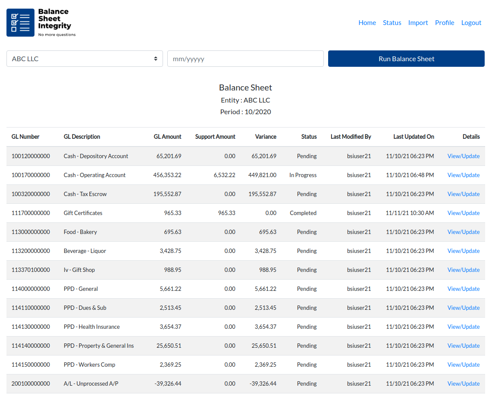
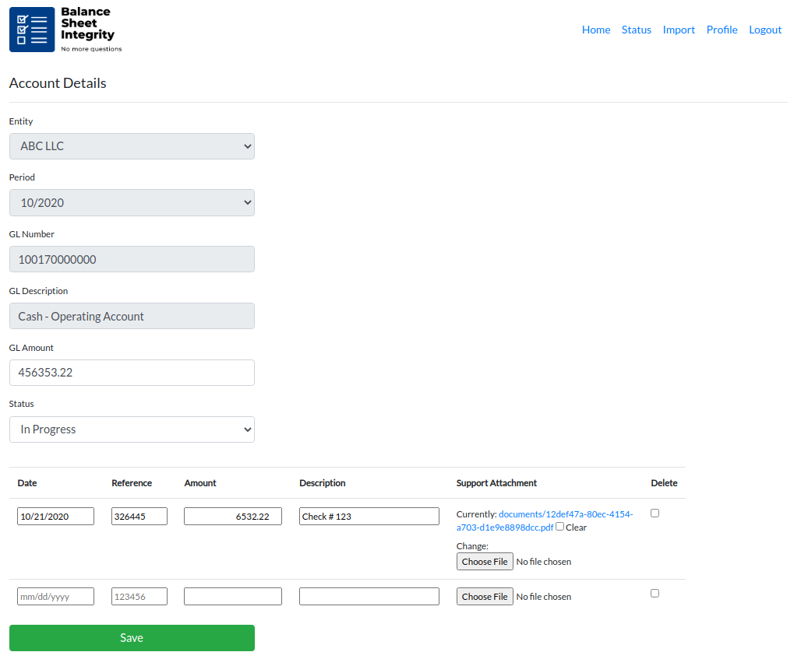
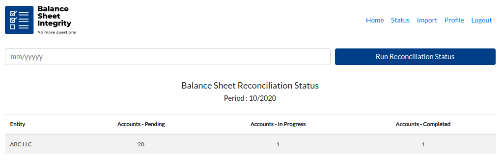
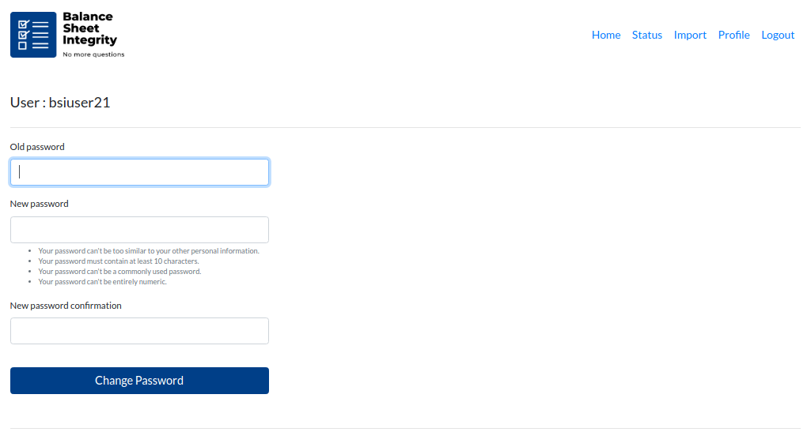

**ABOUT :** BALANCE SHEET INTEGRITY is a platform built with Django Framework. <br>
  - Seamlessly integrate accounting information with 3rd party backup/documentation for easy reconciliation. <br>
  - Create visibility and transparency in the monthly closing process to have the confidence to know that your financials are accurate and reliable. <br>
  - Easily identify the deficiencies on the trial balance to quickly address and rectify. <br>
  - Effortlessly extend your accounting books with full support to CPA or other staff for easy taxes and audits. <br>

**INSTALLATION GUIDE<br>**

Download balance-sheet project and run the following commands inside "balance-sheet-main" directory :<br>

**1. Install Dependecies<br>**
```
sudo apt-get install python3
sudo apt-get install python3-pip
sudo apt-get install python3-venv
```
**2. Run Application<br>**
```
$ source env/bin/activate
$ cd bs
$ python3 manage.py runserver
```
main page : 127.0.0.1:8000/rec<br>
admin     : 127.0.0.1:8000/admin<br>
  
u: bsiuser<br>
p: Testing1234!<br>
<hr>

<hr>

<hr>

<hr>

<hr>
